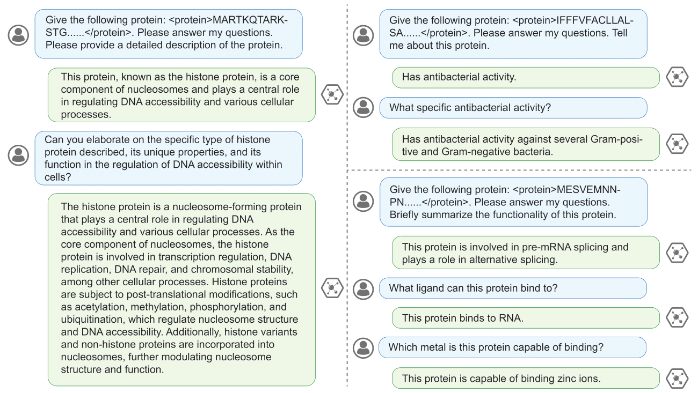
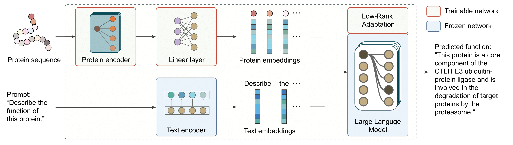

# Multi-Modal Large Language Model Enables Protein Function Prediction

This repository holds the code and data of [Multi-Modal Large Language Model Enables Protein Function Prediction](https://www.biorxiv.org/content/10.1101/2024.08.19.608729v1).

* Update on Jan 5, 2025: change protein encoder from ESM to xtrimoPGLM

## Examples

 

Examples of multi-round dialogues with ProteinChat for Q9U281, Q9XZG9, and Q9LU44.

## Introduction
- ProteinChat is a versatile, multi-modal large language model designed to predict protein functions from amino acid sequences.
- ProteinChat works in a similar way as ChatGPT. Users upload a protein sequence and ask various questions about this protein. ProteinChat will answer these questions in a multi-turn, interactive manner. 
- The ProteinChat system consists of a protein encoder, a large language model (LLM), and an adaptor. The protein encoder takes a protein sequence as input and learns a representation for this protein. The adaptor transforms the protein representation produced by the protein encoder into another representation that is acceptable to the LLM. The LLM takes the representation transformed by the adaptor and users' questions about this protein as inputs and generates answers. All these components are trained end-to-end. We use [xTrimoPGLM-1B](https://arxiv.org/abs/2401.06199) as the protein encoder.
- To train ProteinChat, we designed (protein, prompt, answer) triplets from the functions and keywords from Swiss-Prot dataset, resulting in ~500k proteins and 1.5 million triplets.




## Getting Started
### Installation

**1. Prepare the code and the environment**

Git clone our repository, creating a python environment and ativate it via the following command

```bash
git clone https://github.com/mignonjia/ProteinChat.git
cd ProteinChat
conda env create -f environment.yml
conda activate proteinchat
```

Verify the installation of `torch` and `torchvision` is successful by running `python -c "import torchvision; print(torchvision.__version__)"`. If it outputs the version number without any warnings or errors, then you are good to go. __If it outputs any warnings or errors__, try to uninstall `torch` by `conda uninstall pytorch torchvision torchaudio cudatoolkit` and then reinstall them following [here](https://pytorch.org/get-started/previous-versions/#v1121). You need to find the correct command according to the CUDA version your GPU driver supports (check `nvidia-smi`). 

**2. Prepare the dataset**

The dataset contains 462,019 proteins (represented using 3D structures) with 1.5 million instructions. It is curated from the [Swiss-Prot Dataset](https://www.uniprot.org/uniprotkb?query=*&facets=reviewed%3Atrue). 
The dataset `data.tar.gz` (148 MB) can be downloaded [here](https://drive.google.com/file/d/1n5Ant3S5QE0Yx-DznRa3lannFanc1WB7/view?usp=sharing). Copy it under this folder and run 
```bash
tar -xvf data.tar.gz
```
You will obtain a `data` folder with three subfolders `train_set`, `valid_set`, and `test_set`.

**3. Prepare the pretrained Vicuna weights**

The current version of ProteinChat is built on Vicuna-13B-v1.5.
Please download Vicuna weights from [https://huggingface.co/lmsys/vicuna-13b-v1.5](https://huggingface.co/lmsys/vicuna-13b-v1.5).
Then, set the path to the vicuna weight in the config files 
[configs/proteinchat_stage1.yaml](configs/proteinchat_stage1.yaml#L15) and [configs/proteinchat_stage2.yaml](configs/proteinchat_stage2.yaml#L15).

**4. Prepare the xtrimoPGLM protein encoder**

Download proteinglm-1b-mlm[https://huggingface.co/Bo1015/proteinglm-1b-mlm] to your local machine, and in your downloaded proteinglm folder, modify code Line715 - Line720 of [modeling_proteinglm.py](https://huggingface.co/Bo1015/proteinglm-1b-mlm/blob/main/modeling_proteinglm.py) to the following:
```
        if output_hidden_states:
            all_hidden_states = all_hidden_states + (hidden_states,)

        # Final layer norm.
        if self.post_layer_norm:
            hidden_states = self.final_layernorm(hidden_states)
```

Then in [configs/proteinchat_eval.yaml](configs/proteinchat_eval.yaml#L18), set `glm_load_path` to your local path of proteinglm.
Also, download ProteinChat's trained weights from [Google Drive](https://drive.google.com/file/d/1H-POt4e5Q5fYF59ZwfSdAJyuQiJ2rtJl/view?usp=sharing) and set its path to `stage1_ckpt` in [configs/proteinchat_eval.yaml](configs/proteinchat_eval.yaml#L19).

### Training
**You need at least 55 GB GPU memory for the training.** 

The stage-1 training configuration file is [configs/proteinchat_stage1.yaml](configs/proteinchat_stage1.yaml). In addition, you may want to change the number of epochs and other hyper-parameters there, such as `max_epoch`, `init_lr`, `min_lr`,`warmup_steps`, `batch_size_train`. Please adjust `iters_per_epoch` so that `iters_per_epoch` * `batch_size_train` = your training set size. 

Also, set your desired output directory [here](configs/proteinchat_stage1.yaml#52).

Start stage-1 training by running 
```bash
bash finetune.sh --cfg-path configs/proteinchat_stage1.yaml
``` 

The stage-2 training configuration file is [configs/proteinchat_stage2.yaml](configs/proteinchat_stage2.yaml). Replace the `stage1_ckpt` with the checkpoint you obtained in stage 1. Similar with the previous step, you also need to replace the output directory in this file.

Start stage-2 training by running 
```bash
bash finetune.sh --cfg-path configs/proteinchat_stage2.yaml
``` 

### Evaluation

**It takes around 24 GB GPU memory for the inference.**

Modify the checkpoint paths in [configs/proteinchat_eval.yaml](configs/proteinchat_eval.yaml) to the location of your checkpoint.
Download our ProteinChat's stage1_ckpt [here](https://drive.google.com/file/d/1H-POt4e5Q5fYF59ZwfSdAJyuQiJ2rtJl/view?usp=sharing). peft_ckpt can be set empty during evaluation.
To evaluate stage-2, [this parameter](configs/proteinchat_eval.yaml#L6) needs to be set False.

Evaluate on 20 samples on free-form function prediction and 10 samples for each specific-category prediction by running 
```bash
bash demo.sh
``` 


## Acknowledgement

+ [xTrimoPGLM](https://arxiv.org/abs/2401.06199)
+ [ESM](https://github.com/facebookresearch/esm)
+ [MiniGPT-4](https://minigpt-4.github.io/) 
+ [Lavis](https://github.com/salesforce/LAVIS)
+ [Vicuna](https://github.com/lm-sys/FastChat)


## License
This repository is under [BSD 3-Clause License](LICENSE.md).


## Citation

If you're using ProteinChat in your research or applications, please cite using this BibTeX:
```bibtex
@article{huo2024multi,
  title={Multi-modal large language model enables protein function prediction},
  author={Huo, Mingjia and Guo, Han and Cheng, Xingyi and Singh, Digvijay and Rahmani, Hamidreza and Li, Shen and Gerlof, Philipp and Ideker, Trey and Grotjahn, Danielle A and Villa, Elizabeth and Song, Le and Xie, Pengtao},
  year={2024}
}
```